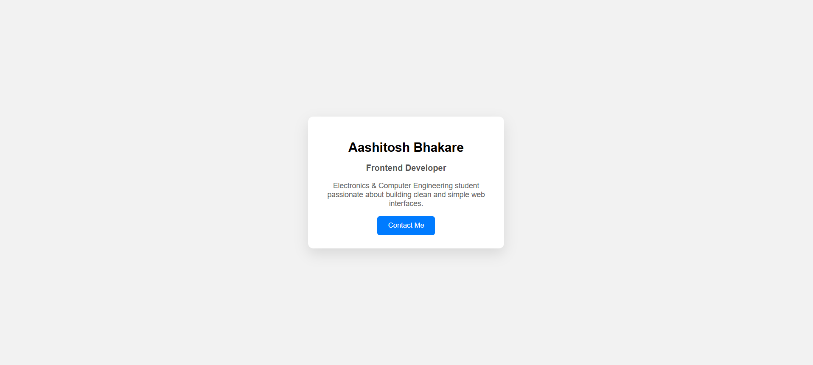

# Profile Card UI

A simple and clean profile card built using **HTML and CSS**.

## 🚀 Features
- Centered card layout
- Clean UI design
- Hover effect on button
- Beginner-friendly project

## 🛠️ Technologies Used
- HTML
- CSS

## 📸 Preview

## 📌 Purpose
This project is part of my learning journey to build consistency on GitHub and strengthen frontend fundamentals.
